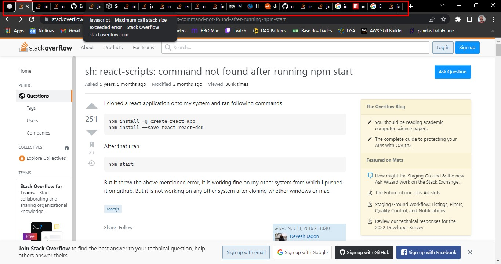
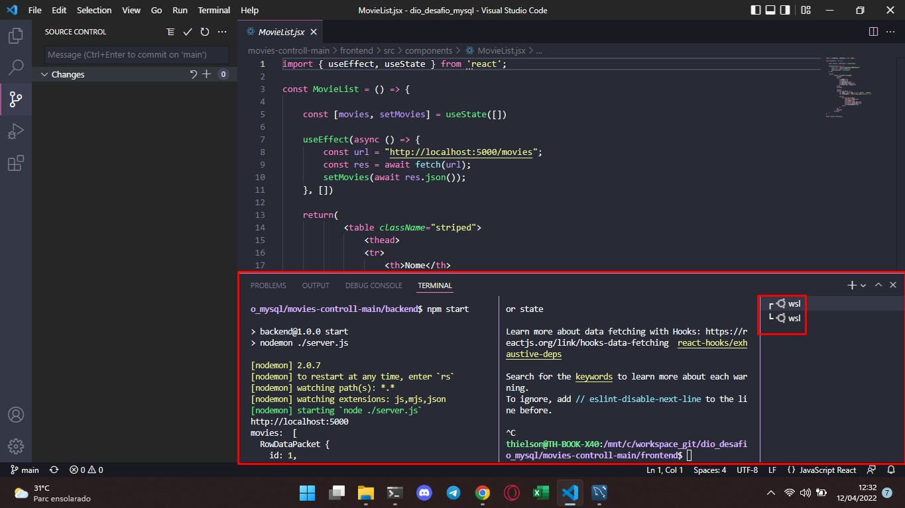
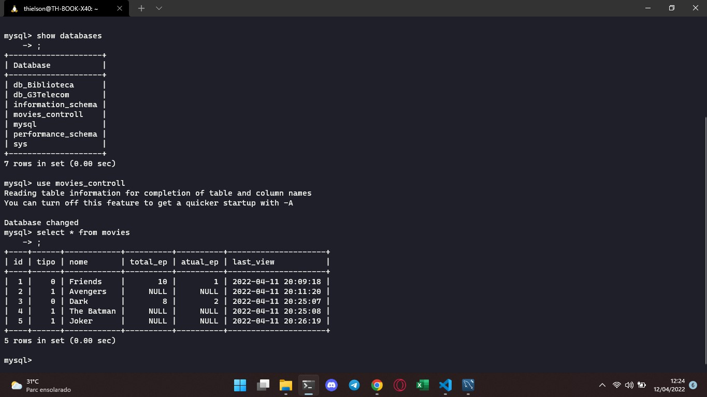
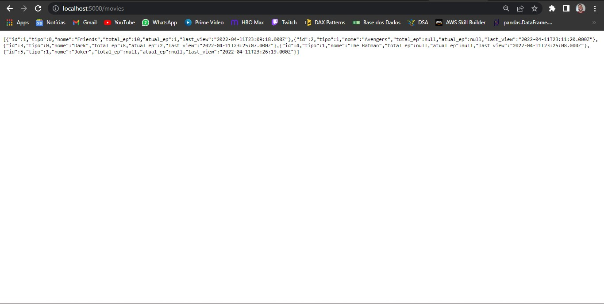
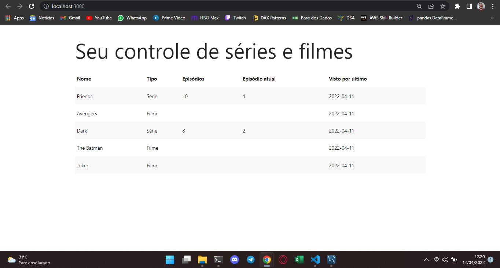

# dio_desafio_mysql

## Descrição

Tive bastante dificulade com este projeto pois ainda não tinha feito nada com nodejs, react. Minhas principais dificuldades foram na instalação, pois não nunca tinha instalado e em varios momentos ficavam faltando alguns modulos, porém depois de muita pesquisa e varias abas do stackoverflow, consegui rodar a aplicação.

Não tive problemas com a criação e conexão com o banco de dados pois ja tenho experiencia com MySQL.

Fiz a instalação dos modulos e pacotes do NodeJS e React no Ubuntu 20-04 via WSL. Utilizei o VS code no Windows e inciei o terminal do Ubuntu pelo proprio Windows e fiz a instalação dos pacotes e modulos e iniciei a aplicação pelo proprio WSL. O servidor MySQl também foi instalado no Ubuntu 20-04 via WSL do Windows, sendo possível acessar por qualquer aplicação Windows uma vez que o WSL compartilha o mesmo localhost. Segue as imagens:

Conseguir rodar a aplicação e meu objtive o seguinte resultado:

